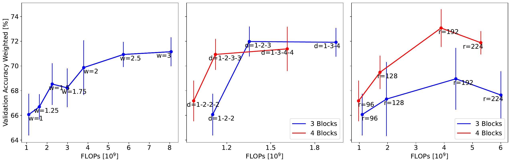
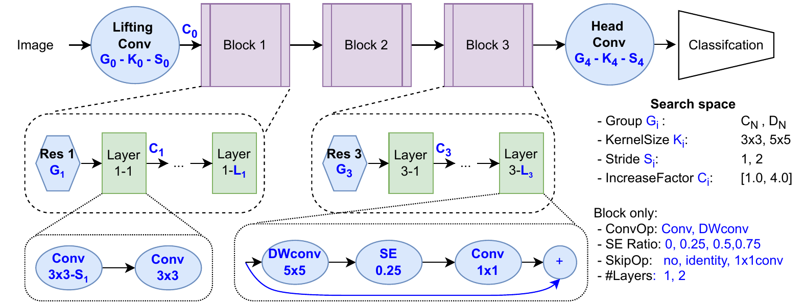
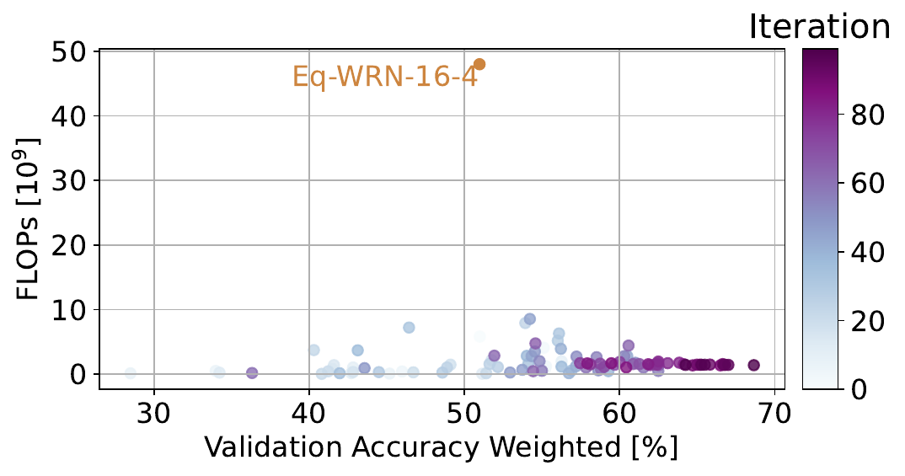
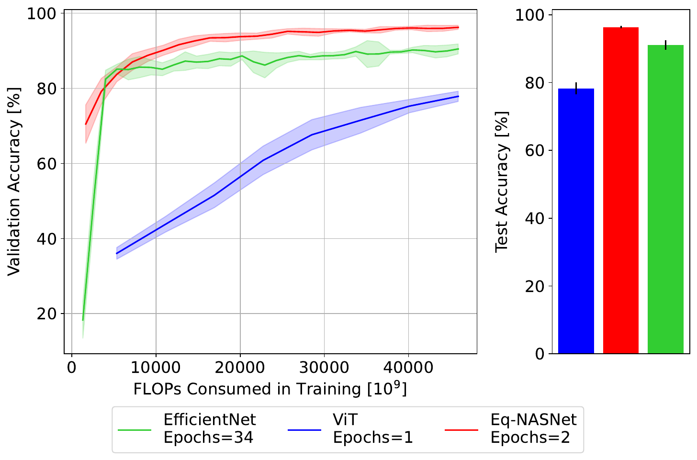
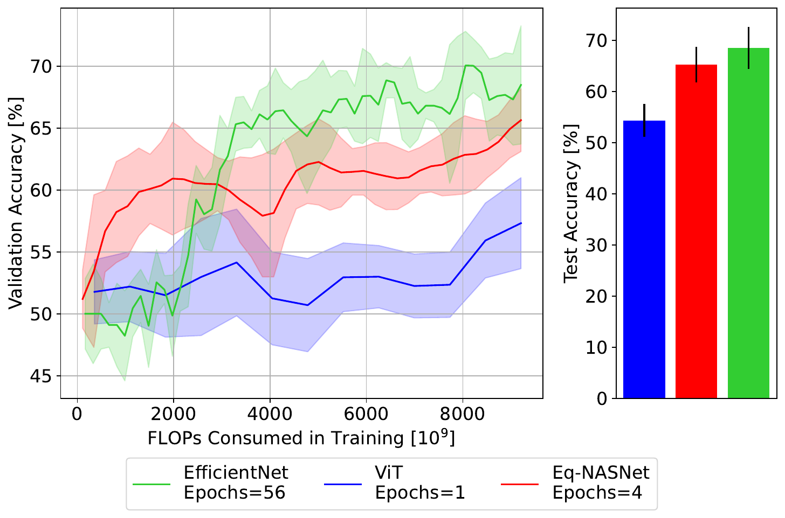
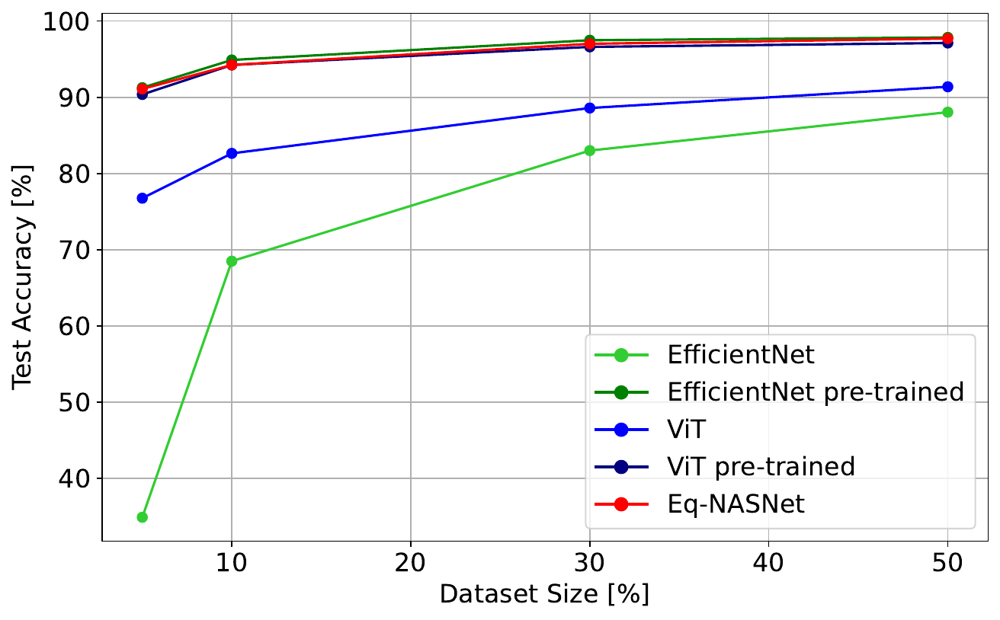
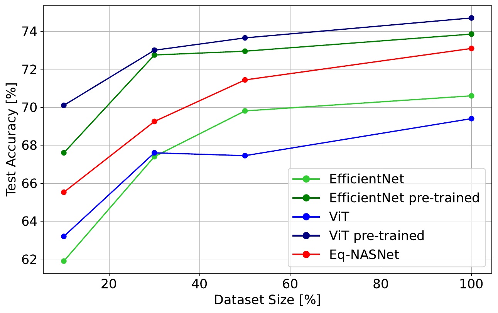
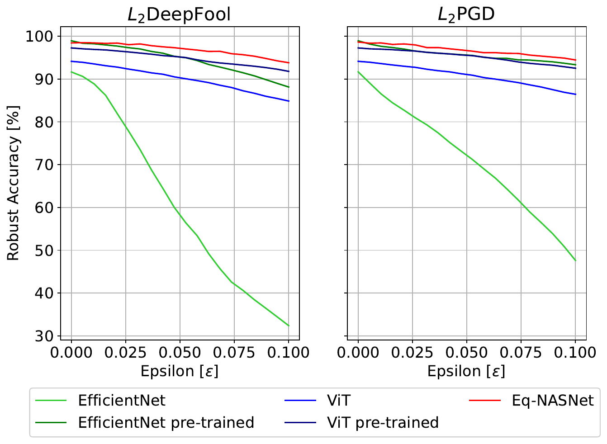
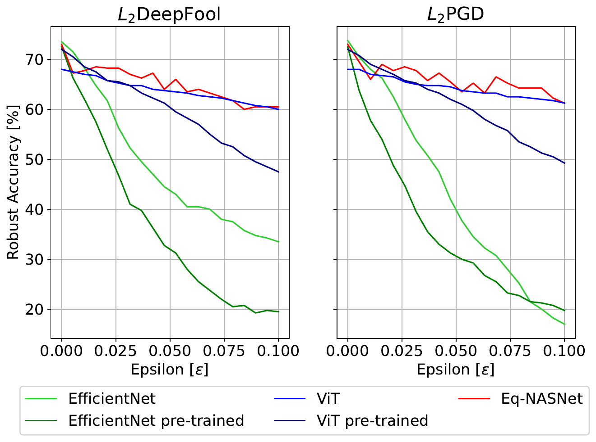

# Scaling Laws of Equivariant Convolutional Neural Networks
Master's thesis of Stefan Frisch at TUM, supervised by Florian Hölzl.
<p align="center"></p>

## Introduction
Equivariant Convolutional Neural Networks (ECNNs) leverage rotational and reflectional symmetries in addition to the translational symmetries from CNNs. Despite their potential, ECNNs often struggle to outperform CNNs due to unexplored design complexities and computational demands. Our study introduces Eq-NASNet, a novel architecture optimized for performance and computational efficiency. A key finding of our research is the empirical demonstration of scaling laws for ECNNs, examining the impact of network width, depth, and resolution on performance. Our comprehensive evaluations reveal that Eq-NASNet surpasses established models like EfficientNet and Vision Transformer (ViT) in medical image classification tasks while having a computational demand similar to EfficientNet. It also excels in low-data scenarios and against adversarial attacks, showcasing its superiority for medical tasks that benefit from enhanced image symmetry exploitation.

Please also check out the project website [here](https://ga92xug.github.io/projects/scaling_laws/).

For additional detail:  
--------------------------------------------------------------------------------
**[Paper]()** | **[Thesis](https://ga92xug.github.io/projects/scaling_laws/path_to_thesis)** | **[Thesis Poster](https://ga92xug.github.io/projects/scaling_laws/path_to_poster)**


## Get started
The code is tested on Ubuntu 20.04.6 LTS with PyTorch 2.0.0 CUDA 11.7 installed.
```shell
conda install pytorch==2.0.0 torchvision==0.15.0 torchaudio==2.0.0 pytorch-cuda=11.7 -c pytorch -c nvidia
```

Install the necessary packages listed out in `requirements.txt`:
```shell
pip install -r requirements.txt
```

Create a file `configs/local/default.yaml` where you specify the data directory. This is where the datasets are expected. In `configs/local/looks_like.yaml` 2 examples how your local configuration could look like.

You can try out our pre-trained Eq-NASNet with the following command. The Camelyon17 dataset is downloaded in this case automatically for you. For the other datasets see the section datasets.

```shell
python src/main.py train=camelyon17 train/network=eq_nasnet_pre train.dataset.download=True
```

## Dataset

Download the necessary datasets and adjust the `data_dir` in `training/conf/config.yaml`.
We used the following datasets for our experiments:
- [ISIC2019](https://challenge.isic-archive.com/data/#2019)
- [Blood](https://www.sciencedirect.com/science/article/pii/S2352340920303681)
- [OCT](https://data.mendeley.com/datasets/rscbjbr9sj/3)
- [HAM10000](https://dataverse.harvard.edu/dataset.xhtml?persistentId=doi:10.7910/DVN/DBW86T)
- [Derm7pt](https://derm.cs.sfu.ca/Welcome.html)
- [Camelyon17](https://github.com/p-lambda/wilds/) This dataset can be autmatically downloaded by setting train.dataset.download=True

Not sure we will need them:
- [CIFAR10](https://www.cs.toronto.edu/~kriz/cifar.html)
- [MNIST rot](https://github.com/QUVA-Lab/e2cnn_experiments)
- [Galaxy10 DECals](https://github.com/henrysky/Galaxy10)

## Method
The scripts to run the following experiments can be found in `scripts/` in the respective subfolders. 

### New ECNN Baseline Architecture
Search for a new ECNN baseline architecture with [Ax](https://github.com/facebook/Ax). This is an illustration of the search space:
<p align="center"></p>

The search space can be changed in the config `src/optimization/configs` and further extended in `src/optimization/NAS`.

The multiobjective search trades off accuracy against compute. Each point is one sampled architecture on ISIC2019, coloured by search iteration, with the Eq-WRN-16-4 baseline for reference:
<p align="center"></p>

--------------------------------------------------------------------------------
### Scaling Laws
We empirically showed the existence of scaling laws for ECNNs. The following figure shows the scaling laws for the width, depth, and resolution of ECNNs on the ISIC2019 dataset:
<p align="center"></p>

## Evaluation
We evaluated our Eq-NASNet against established models like EfficientNet and Vision Transformer (ViT):
ToDo update numbers

| Model | Test Accuracy Weighted | Parameters | FLOPs |
|-------|---------------|------------|-------|
| [**Gessert et al.**](https://arxiv.org/abs/1910.03910) <br>single model | 68.8 (±0.7) | 40.76 | 19.97 |
| **EfficientNet** | 39.76 (±1.52) | 4.01 | **0.14** |
| $\hookrightarrow$ pre-trained | 62.97 (±3.33) | 4.01 | **0.14** |
| **ViT** | 43.51 (±1.89) | 85.69 | 5.5 |
| $\hookrightarrow$ pre-trained | 66.34 (±1.64) | 85.69 | 5.5 |
| **Eq-NASNet** | **69.69 (±0.07)** | **0.66** | 1.7 |

### Training Efficiency
Validation accuracy against the FLOPs consumed in training, plus the resulting test accuracy. Eq-NASNet is the most compute efficient early in training on both datasets and ends ahead on Blood, whereas EfficientNet needs many more epochs but overtakes it on DeepDRiD. Blood (left) and DeepDRiD (right):
<p align="center">
  
  
</p>

### Low Data Regime
Test accuracy when training on subsets of the data. Eq-NASNet beats both models trained from scratch throughout. On Blood it also matches the pre-trained baselines down to 5% of the data, while on DeepDRiD it stays behind them. Blood (left) and DeepDRiD (right):
<p align="center">
  
  
</p>

### Adversarial Attacks
Robust accuracy under $L_2$ DeepFool and $L_2$ PGD for increasing perturbation budgets. Eq-NASNet retains the highest robust accuracy on both datasets, matched by ViT only at the largest budgets on DeepDRiD, while both EfficientNet variants degrade sharply. Blood (left) and DeepDRiD (right):
<p align="center">
  
  
</p>

### Domain Shift
ToDo: add images from paper


## Caveats
Unfortunatly the Hydra Ax sweeper that we use for the HPO requires a Ax version that does not support multiobjective optimization yet. However we need multiobjective optimization for the Neural Architecture Search. This should be fixed in the next version. Currently we recommend a separate environment where you adjust the Ax version for the HPO:

```shell
pip install gpytorch==1.8.1 # hydra fixes the wrong gpytorch version currently
pip install ax-platform==0.2.0 # multiobjective not supported
pip install hydra-ax-sweeper --upgrade # install the plugin
```
Known caveats: https://github.com/facebookresearch/hydra/issues/2813, https://github.com/pytorch/botorch/issues/1370 

## Acknowledgement
We want to thank [QUVA-Lab/escnn](https://github.com/QUVA-Lab/escnn) for the awesome ECNN library. We also want to thank the [Lightning-Hydra-Template](https://github.com/ashleve/lightning-hydra-template) for their clean trainingscode template.

## License
Scaling Laws of Equivariant Convolutional Neural Networks is licensed under a [Creative Commons Attribution-NonCommercial-ShareAlike 3.0 Unported License](LICENSE).

Copyright (c) 2023 Stefan Frisch, Florian Hölzl, Georgios Kaissis
