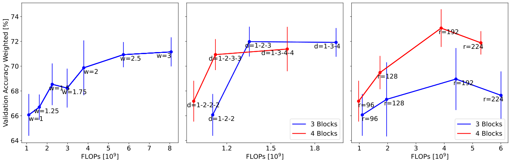

# Scaling Laws of Equivariant Convolutional Neural Networks
Master's thesis of Stefan Frisch at TUM, supervised by Florian Hölzl.
<p align="center"></p>

## Introduction
Equivariant Convolutional Neural Networks (ECNNs) leverage rotational and reflectional symmetries in addition to the translational symmetries from CNNs. Despite their potential, ECNNs often struggle to outperform CNNs due to unexplored design complexities and computational demands. Our study introduces Eq-NASNet, a novel architecture optimized for performance and computational efficiency. A key finding of our research is the empirical demonstration of scaling laws for ECNNs, examining the impact of network width, depth, and resolution on performance. Our comprehensive evaluations reveal that Eq-NASNet surpasses established models like EfficientNet and Vision Transformer (ViT) in medical image classification tasks while having a computational demand similar to EfficientNet. It also excels in low-data scenarios and against adversarial attacks, showcasing its superiority for medical tasks that benefit from enhanced image symmetry exploitation.

Please also check out the project website [here](https://daveredrum.github.io/ScanRefer/).

For additional detail:  
--------------------------------------------------------------------------------
**[Poster]()** | **[Thesis]()** 

ich brauche noch eine github page damit man sowas machen kann https://gabri95.github.io/Thesis/thesis.pdf


## Setup
The code is tested on Ubuntu 20.04.6 LTS with PyTorch 2.0.0 CUDA 11.7 installed.
```shell
conda install pytorch==2.0.0 torchvision==0.15.0 torchaudio==2.0.0 pytorch-cuda=11.7 -c pytorch -c nvidia
```

Install the necessary packages listed out in `requirements.txt`:
```shell
pip install -r requirements.txt
```

Adjust the output folder etc. in `training/conf/config.yaml`.

Unfortunatly the Hydra Ax sweeper that we use for the HPO requires a Ax version that does not support multiobjective optimization yet. However we need multiobjective optimization for the Neural Architecture Search. This should be fixed in the next version. Currently we recommend a separate environment where you adjust the Ax version for the HPO:

```shell
pip install gpytorch==1.8.1 # hydra fixes the wrong gpytorch version currently
pip install ax-platform==0.2.0 # multiobjective not supported
pip install hydra-ax-sweeper --upgrade # install the plugin
```
Known caveats: https://github.com/facebookresearch/hydra/issues/2813, https://github.com/pytorch/botorch/issues/1370 

## Dataset

Download the necessary datasets and adjust the `data_dir` in `training/conf/config.yaml`.
We used the following datasets for our experiments:
- [CIFAR10](https://www.cs.toronto.edu/~kriz/cifar.html)
- [MNIST rot](https://github.com/QUVA-Lab/e2cnn_experiments)
- [Galaxy10 DECals](https://github.com/henrysky/Galaxy10)
- [ISIC2019](https://challenge.isic-archive.com/data/#2019)
- [DeepDRiD](https://github.com/deepdrdoc/DeepDRiD)
- [Blood](https://www.sciencedirect.com/science/article/pii/S2352340920303681)

## Method

### New ECNN Baseline Architecture
Search for a new ECNN baseline architecture with [Ax](https://github.com/facebook/Ax). This is an illustration of the search space:
<p align="center"></p>

The search space can be changed in the folder `experiments/NAS`.

--------------------------------------------------------------------------------
### Scaling Laws
We empirically showed the existence of scaling laws for ECNNs. The following figure shows the scaling laws for the width, depth, and resolution of ECNNs on the ISIC2019 dataset:
<p align="center"></p>

The experiments can be found in the folder `experiments/scaling`.

## Evaluation
We evaluated our Eq-NASNet against established models like EfficientNet and Vision Transformer (ViT):

| Model | Test Accuracy | Parameters | FLOPs |
|-------|---------------|------------|-------|
| [**Gessert et al.**](https://arxiv.org/abs/1910.03910) <br>single model | 68.8 (±0.7) | 40.76 | 19.97 |
| **EfficientNet** | 39.76 (±1.52) | 4.01 | **0.14** |
| $\hookrightarrow$ pre-trained | 62.97 (±3.33) | 4.01 | **0.14** |
| **ViT** | 43.51 (±1.89) | 85.69 | 5.5 |
| $\hookrightarrow$ pre-trained | 66.34 (±1.64) | 85.69 | 5.5 |
| **Eq-NASNet** | **69.69 (±0.07)** | **0.66** | 1.7 |

The experiments can be found in the folder `experiments/compare`.

### Efficiency
We compared the efficiency of Eq-NASNet against EfficientNet and ViT. The following figure shows the accuracy of the models for different computational budgets:

### Low Data Regime


### Adversarial Attacks

## Acknowledgement
We would like to thank [QUVA-Lab/escnn](https://github.com/QUVA-Lab/escnn) for the ECNN library.

## License
ScanRefer is licensed under a [Creative Commons Attribution-NonCommercial-ShareAlike 3.0 Unported License](LICENSE).

Copyright (c) 2023 Stefan Frisch, Florian Hölzl, Georgios Kaissis
